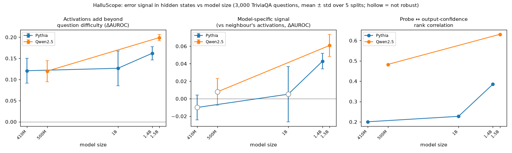

# HalluScope

**Can a language model know it's about to be wrong — before it answers?**

HalluScope reads a model's internal activations at the moment it finishes reading a
question, and predicts whether its upcoming answer will be wrong. No answer is generated
first. A system using it could skip, flag, or reroute a risky question *before* spending
compute on a wrong answer.

## How it works

1. Ask the model a closed-book question: *"Who wrote Hamlet?"*
2. Read its hidden state (every layer) at the last token of the question.
3. A **linear probe** — logistic regression, written from scratch — turns that hidden state
   into a risk score: *how likely is the answer about to be wrong?*
4. Let the model answer, grade it automatically, and measure how well the risk score
   separated right answers from wrong ones.

The hard part isn't training the probe — it's proving what the probe detects. Some
questions are simply hard for everyone, so a probe could look good just by spotting hard
*questions*. Most of this repo exists to rule that out: difficulty controls, another
model's activations as a control, 5 train/test splits per result, bootstrap confidence
intervals, and a negation test designed to break the probe.

## Results

Every number below is generated by code from saved result files:
```bash
PYTHONPATH=src python -m halluscope.report --config configs/results.yaml --readme README.md
```

<!-- RESULTS:START -->
*Generated by `python -m halluscope.report` from saved result files -- no number here is hand-typed.*

### Key findings

- **The model knows more than question difficulty.** Hidden states add +0.12 to +0.20 AUROC beyond a question-only difficulty model, robust in 5/5 models.
- **Model-specific self-knowledge appears only in: Pythia-1.4B, Qwen2.5-1.5B.** In smaller models, a neighbouring model's activations predict the errors equally well.
- **The probe and the model's own token confidence converge as models improve** (rank correlation 0.20 → 0.63); combining them helps in 5/5 models.
- **The error signal transfers to false statements** it never trained on (True/false city facts (Qwen2.5-1.5B): 0.77 AUROC).
- **It is not a truth detector:** on negated statements transfer falls to 0.51, and layer 14 inverts to 0.017 -- it tracks mismatched associations.
- **It is cheap:** the probe matched (difference not significant) self-consistency (0.80 vs 0.75 AUROC) using 68× fewer forward passes -- and before any answer is generated.

### Scale study

| Model | Accuracy | Probe AUROC | Beyond difficulty | Model-specific | Probe vs output conf. | Probe+output vs output | Rank corr. |
|---|---|---|---|---|---|---|---|
| Pythia-410M | 10.7% | 0.741 | +0.121 (5/5) ✅ | -0.010 (0/5) ❌ | +0.128 (5/5) ✅ | +0.145 (5/5) ✅ | 0.20 |
| Pythia-1B | 15.4% | 0.711 | +0.126 (5/5) ✅ | +0.005 (1/5) ❌ | +0.047 (1/5) ❌ | +0.069 (5/5) ✅ | 0.23 |
| Pythia-1.4B | 20.4% | 0.762 | +0.162 (5/5) ✅ | +0.043 (4/5) ✅ | +0.051 (3/5) ✅ | +0.066 (5/5) ✅ | 0.38 |
| Qwen2.5-0.5B | 19.2% | 0.765 | +0.120 (5/5) ✅ | +0.008 (0/5) ❌ | +0.034 (2/5) ❌ | +0.059 (5/5) ✅ | 0.48 |
| Qwen2.5-1.5B | 35.6% | 0.795 | +0.199 (5/5) ✅ | +0.061 (5/5) ✅ | -0.011 (0/5) ❌ | +0.033 (5/5) ✅ | 0.63 |



### Cross-domain transfer

| Probe trained on trivia errors → tested on | Transfer AUROC (QA-chosen layer) | Best single layer (descriptive) | Most inverted layer (descriptive) |
|---|---|---|---|
| True/false city facts (Qwen2.5-1.5B) | 0.767 (range 0.681–0.823, 5 seeds) | 0.996 | L28 = 0.382 |
| Spanish-English translations (Qwen2.5-1.5B) | 0.836 | 0.991 | L5 = 0.439 |
| Negated city facts (Qwen2.5-1.5B) | 0.512 | 0.677 | L14 = 0.017 |

### Cost: probe vs self-consistency

*Qwen2.5-1.5B, 500 held-out questions, self-consistency with k=10 samples at temperature 0.7*

| Method | AUROC [95% CI] | Forward passes | ms / question (this Mac) | Cost vs probe |
|---|---|---|---|---|
| probe (prompt only) | 0.799 [0.758, 0.837] | 1.0 | 99 | 1.0× |
| neg_min_logprob (greedy answer) | 0.782 [0.739, 0.821] | 7.5 | 431 | 7.5× |
| self-consistency (greedy + 10 samples) | 0.749 [0.703, 0.794] | 68.3 | 3660 | 68.3× |

- probe - self_consistency: +0.050 AUROC, 95% CI [-0.003, +0.103] (not significant)
- self_consistency - neg_min_logprob: -0.033 AUROC, 95% CI [-0.072, +0.008] (not significant)

<!-- RESULTS:END -->

## What held up, and what didn't

| Original hypothesis | Outcome |
|---|---|
| A probe on hidden states predicts wrong answers better than the model's own token confidence | **Partly.** The probe complements token confidence in every model, but only clearly beats it in some; in the strongest model they tie. |
| …at far lower cost than self-consistency sampling | **Confirmed.** Equal-or-better error detection at a small fraction of the forward passes. |
| The signal lives in the *middle* layers | **Wrong.** The error signal peaks in the upper layers. The mid layers held something else: a mismatched-association detector that inverts under negation. |

## Reproducing everything

```bash
pip install -e . -r requirements.txt
pytest -q -m "not slow"                                  # fast tests, fully offline

pip install datasets                                     # data (see data/README.md)
python scripts/prepare_triviaqa.py --n 3000 --out data/raw/triviaqa3k.jsonl

# 1. run a model once, cache hidden states + answers + token confidences
python -m halluscope.run --model Qwen/Qwen2.5-1.5B --data data/raw/triviaqa3k.jsonl --cache cache/qwen15_tqa3k.npz
# 2. layer sweep, controls, stacking, CIs -- repeated over 5 train/test splits
python -m halluscope.robustness --cache cache/qwen15_tqa3k.npz --control-cache cache/qwen05_tqa3k.npz --out reports/qwen15_3k
# 3. cross-domain transfer to true/false statements
python -m halluscope.transfer --model Qwen/Qwen2.5-1.5B --qa-cache cache/qwen15_tqa3k.npz --statements data/raw/cities.csv --stmt-cache cache/qwen15_cities.npz --out reports/transfer_qwen15
# 4. cost benchmark against self-consistency
python -m halluscope.selfconsistency --model Qwen/Qwen2.5-1.5B --data data/raw/triviaqa3k.jsonl --qa-cache cache/qwen15_tqa3k.npz --out reports/sc_qwen15
# 5. regenerate the Results section
python -m halluscope.report --config configs/results.yaml --readme README.md
```
On Apple Silicon, models load in half precision automatically. All model runs are cached,
so every analysis step reruns in minutes without touching the model.

## Serving it

```bash
python -m halluscope.export --model Qwen/Qwen2.5-1.5B --qa-cache cache/qwen15_tqa3k.npz --out artifacts/qwen15_probe
ARTIFACT_DIR=artifacts/qwen15_probe python -m uvicorn halluscope.serve:app --port 8000
```

| Endpoint | What it does |
|---|---|
| `POST /assess` `{"question": ...}` | Risk score from the question alone. **No answer is generated.** |
| `POST /answer` `{"question": ..., "abstain_above": 0.8}` | Risk first; above the threshold it abstains **without generating**, otherwise it answers, reusing the same forward pass, so the probe adds no extra model work. |
| `GET /info`, `GET /health` | Model, probe layer, held-out AUROC estimate; liveness |

Interactive docs at `http://127.0.0.1:8000/docs` while the server runs.

## Demo

`demo/streamlit_app.py` shows held-out predictions for every question: an **abstention
simulator** (skip the riskiest X% of questions and see accuracy rise), a searchable table of
questions, answers and risk scores, and the research results.

```bash
python -m halluscope.demo_data --cache cache/qwen15_tqa3k.npz --data data/raw/triviaqa3k.jsonl \
    --name "Qwen2.5-1.5B" --out reports/demo/qwen15.csv
streamlit run demo/streamlit_app.py
```
The demo runs from these precomputed predictions, not a live model: free hosting can't hold a
1.5B-parameter model. It has its own `demo/requirements.txt`, so hosting never installs PyTorch.

## Project layout

```
src/halluscope/
  data/datasets.py      QA + true/false loaders, answer grading
  models/lm.py          model loading, hand-written greedy decoding, hidden-state capture
  collect.py            run a model over a dataset once, cache everything
  probes/linear.py      logistic-regression probe (from scratch), train-only standardization
  eval/metrics.py       AUROC, ECE, selective accuracy, AURC (from scratch)
  eval/stats.py         bootstrap CIs, paired bootstrap differences
  eval/controls.py      question-difficulty control features
  analyze.py            layer sweep, controls, stacking, paired tests
  robustness.py         the analysis repeated over several train/test splits
  transfer.py           trivia-error probe tested on true/false statements
  selfconsistency.py    self-consistency baseline + cost benchmark
  report.py             generates the Results section and figure
  export.py             trains + saves the deployable probe artifact
  serve.py              FastAPI service: /assess, /answer
  demo_data.py          held-out per-question predictions for the demo
demo/streamlit_app.py   the demo app (pandas + streamlit only)
```

## Limitations

- Two model families (Pythia, Qwen2.5), five sizes, 410M–1.5B parameters. A 3B model didn't
  fit in this laptop's memory. "Emerges with scale" is a trend over these sizes, not a law.
- One QA dataset (TriviaQA, closed-book) and one prompt format.
- Transfer and negation results are from one model (Qwen2.5-1.5B) and one negation dataset.
- Self-consistency was run at one untuned setting; a tuned setting might do better.
- Wall-clock times are from one MacBook; forward-pass counts are the hardware-independent
  cost measure.

More detail: [`docs/METRICS.md`](docs/METRICS.md) (every metric, in plain words),
[`docs/ARCHITECTURE.md`](docs/ARCHITECTURE.md), and [`docs/ASSUMPTIONS.md`](docs/ASSUMPTIONS.md)
(assumptions, deviations, and mistakes caught along the way).
