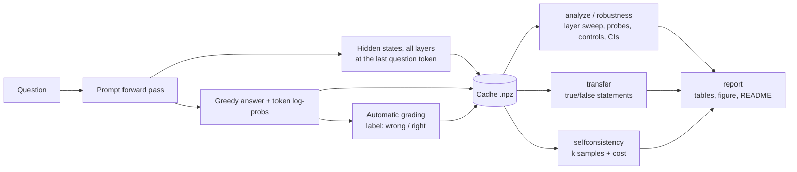

# Architecture

## The two phases

**Collection (slow, once per model).** `run.py` → `collect.py` → `models/lm.py`. For each
question: one forward pass over the prompt captures every layer's hidden state at the last
token (**before** any answer exists); then a hand-written greedy loop generates the answer
and records each token's log-probability and entropy. The answer is graded against all
accepted aliases. Everything is cached to disk.

**Analysis (fast, from cache).** Every analysis reads the cache and never touches the model.
That's what makes 5-split robustness, stacking, and controls affordable on a laptop.

## Leakage rules (enforced in code, and tested)

- **One stratified train/test split per seed**, shared by every scorer.
- **The probe's layer and regularization are chosen on training data only** (an inner
  validation split). The test-set layer sweep is plotted, but it never picks the headline.
- **Standardization statistics come from training data only.**
- **Stacking uses out-of-fold probe scores:** every training row is scored by a probe that
  never saw it. A test proves an in-sample probe memorizes noise while out-of-fold scores
  stay at chance.
- **Self-consistency questions are held out** from the probe's training entirely.
- **"Descriptive only" numbers** (best or worst single layer) are labelled as such: they were
  found by looking at test results, so they can't be headline claims.

## Why the probe is linear

If one straight direction in activation space separates "about to be right" from "about
to be wrong", the model is representing its own uncertainty in a simple, explicit form. A
nonlinear probe could learn the task itself from rich features and would prove much less.
